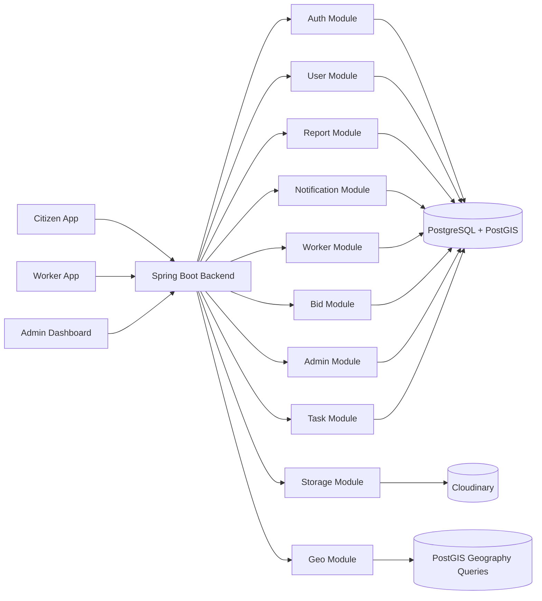
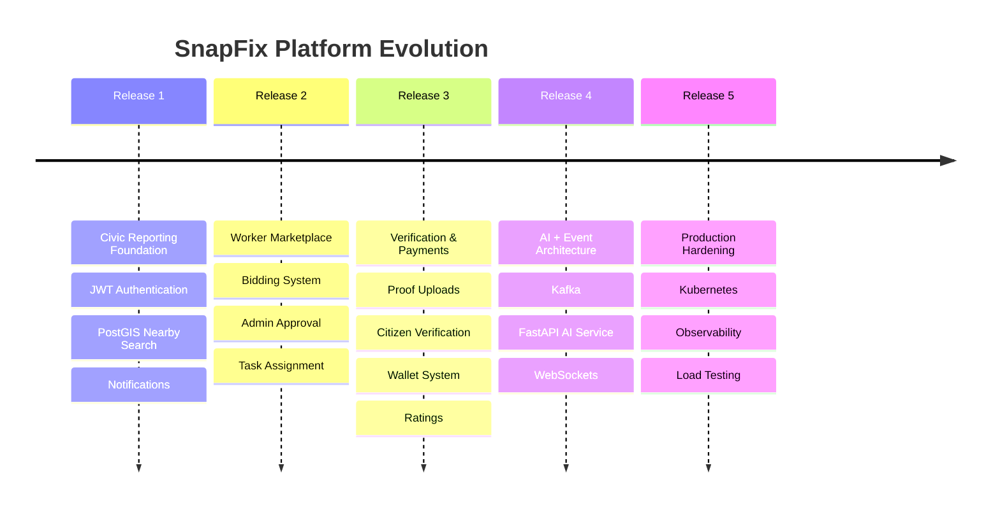
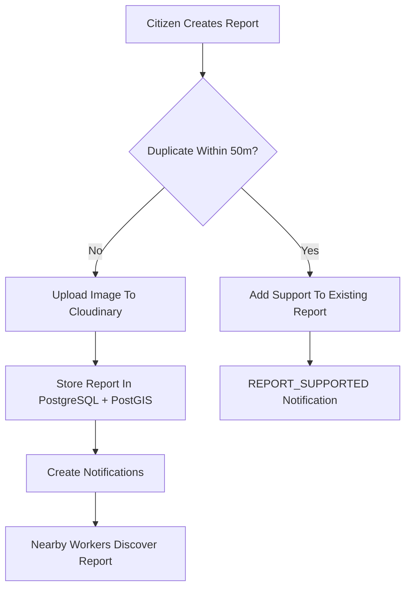
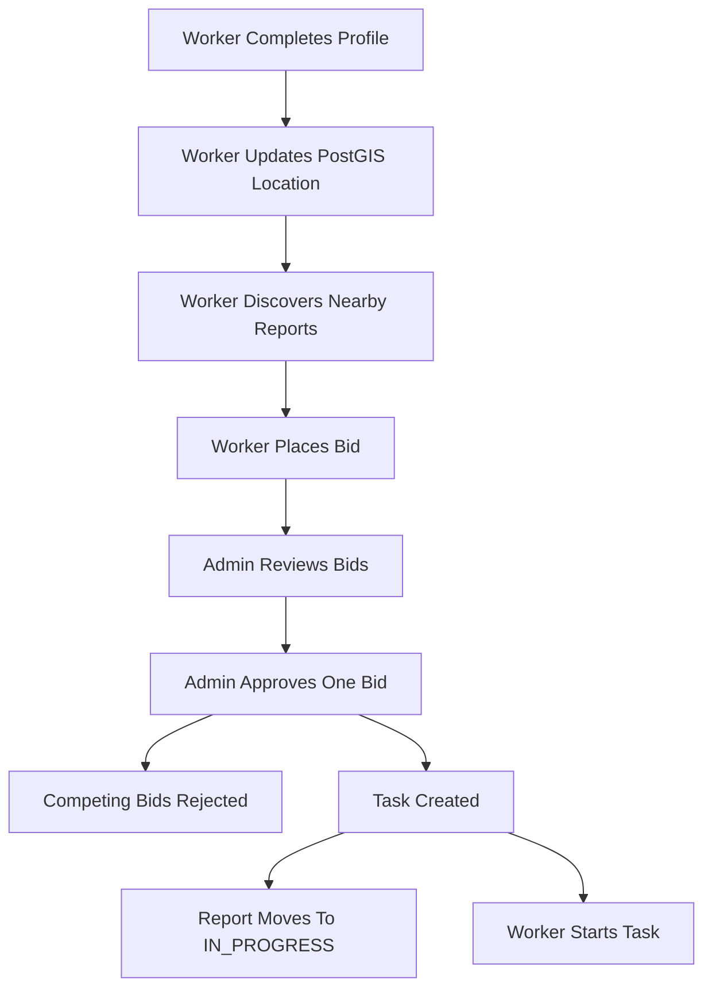
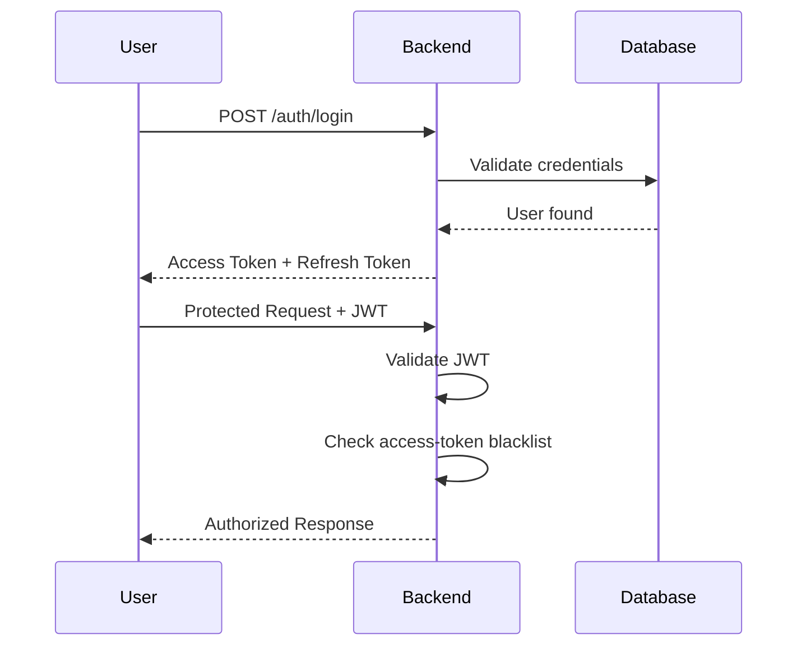
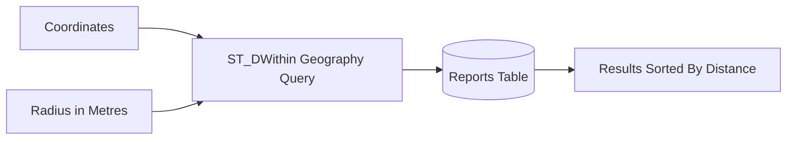
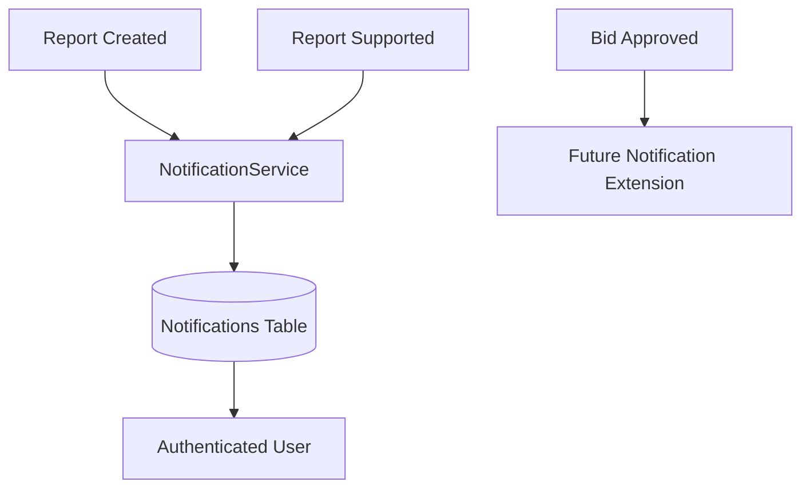
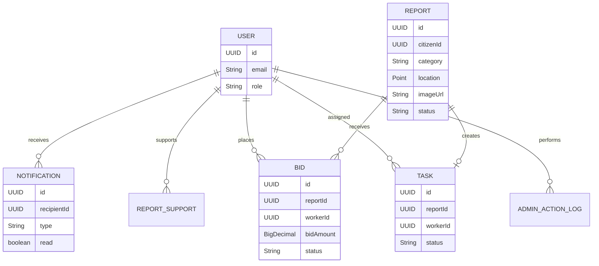
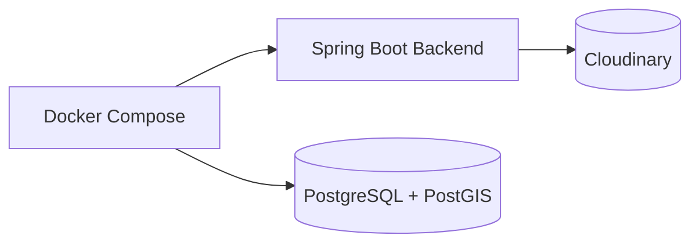
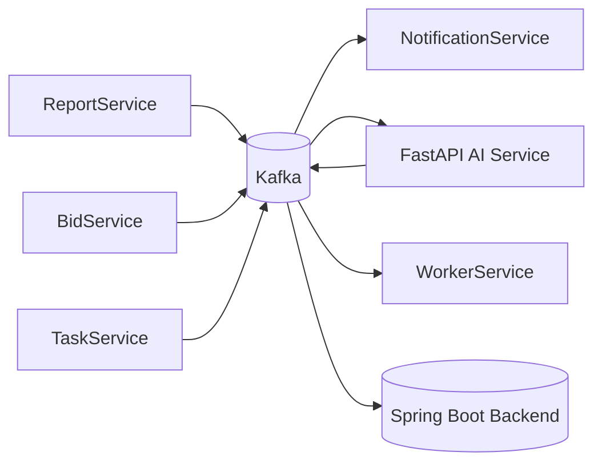

# SnapFix Backend

> Civic infrastructure platform with geospatial reporting, JWT security, PostGIS-powered discovery, worker bidding, admin task assignment, and a roadmap toward event-driven AI architecture.


---

# Overview

SnapFix is a civic infrastructure backend where citizens can report issues such as:

- Potholes
- Garbage accumulation
- Broken streetlights
- Water leaks
- Road damage

Reports include:

- GPS coordinates
- Uploaded images
- Category classification
- Nearby discovery support
- Duplicate detection
- Citizen support counts
- Stored notifications

Release 2 adds the worker marketplace flow:

- Workers complete profiles and maintain current PostGIS location
- Workers discover nearby reports from their stored location
- Workers place and withdraw bids
- Admins approve one bid per report
- The system creates an assigned task automatically
- Assigned workers move tasks from `ASSIGNED` to `IN_PROGRESS`

This repository contains the Spring Boot backend for:

# Release 2 - Worker Marketplace and Task Assignment

---

# Motivation

SnapFix was built to explore:

- Geospatial backend engineering
- PostGIS-powered discovery systems
- JWT authentication and authorization
- Real-world civic workflows
- Modular monolith architecture
- Worker marketplace and task-assignment workflows
- Scalable backend evolution toward distributed systems

The long-term goal is to evolve SnapFix from a modular monolith into a production-grade event-driven platform with AI-assisted infrastructure analysis.

---

# Release Status

| Area | Status |
|---|---|
| Release 1 - Civic Reporting Foundation | Complete |
| Phase 1 - Platform Foundation | Complete |
| Phase 2 - Identity and User System | Complete |
| Phase 3 - Civic Report System | Complete |
| Phase 4 - Discovery and Notifications | Complete |
| Release 2 - Worker Marketplace and Task Assignment | Complete |
| Latest Test Result | `.\mvnw.cmd test` - 33 tests passing |

---

# Architecture



---

# Release Roadmap



---

# Engineering Highlights

- PostGIS metre-based geo queries using `ST_DWithin`
- Report and worker locations stored as `geometry(Point, 4326)`
- JWT authentication with refresh-token rotation
- Access-token blacklist on logout
- Multipart image upload pipeline with Cloudinary
- Duplicate report detection within 50 metres
- One support per user per report enforcement
- Role-based access control (`CITIZEN`, `WORKER`, `ADMIN`)
- Worker marketplace with bid placement, withdrawal and duplicate prevention
- Admin approval flow that rejects competing bids and creates one task
- Task ownership enforcement for worker task access
- Structured validation and exception responses
- Dockerized local development
- PostgreSQL/PostGIS integration tests using Testcontainers
- Modular monolith architecture designed for future microservice extraction

---

# Tech Stack

| Layer | Technology |
|---|---|
| Language | Java 21 |
| Backend Framework | Spring Boot 4.0.6 |
| Security | Spring Security + JWT |
| ORM | Spring Data JPA |
| Database | PostgreSQL + PostGIS |
| Geospatial Support | Hibernate Spatial + JTS |
| Image Storage | Cloudinary |
| Containerization | Docker + Docker Compose |
| Testing | JUnit 5 + MockitoBean + AssertJ + Testcontainers |

---

# Features

- Register/login users as `CITIZEN`, `WORKER`, or `ADMIN`
- JWT access tokens and refresh-token rotation
- Logout with refresh-token revocation and access-token blacklist
- Citizen and worker profile APIs
- Worker profile completion with skills, availability and PostGIS location
- Multipart report creation with image upload
- Nearby report discovery using PostGIS geography queries
- Worker nearby discovery from stored worker location
- Duplicate report detection within 50 metres
- One support per user per report
- Stored notifications for report events
- Read/unread notification filtering
- Worker bidding marketplace
- Admin bid approval and rejection
- Automatic task creation on bid approval
- Worker task listing and `ASSIGNED -> IN_PROGRESS` transition
- Structured validation and authorization error responses

---

# Report Lifecycle



---

# Worker Marketplace Flow



---

# Authentication Flow



---

# Nearby Search Logic



---

# Notification Flow



---

# Core Entity Relationships



---

# Project Structure

```text
src/main/java/com/snapfix/

  admin/         admin governance and audit logging
  auth/          authentication, JWT, refresh tokens
  bid/           worker bid marketplace
  user/          users, citizen profiles, worker profiles
  report/        civic reports, duplicate detection, support
  notification/  stored notifications and read state
  worker/        worker profile, location, discovery and task APIs
  task/          assigned task lifecycle
  storage/       Cloudinary image upload abstraction
  geo/           PostGIS/JTS helpers
  common/        shared entities, exceptions and utilities
  config/        security, Cloudinary and request logging config
```

---

# Performance Targets

| Metric | Target |
|---|---|
| API Response Time | < 200ms |
| Nearby Search Query | < 200ms |
| Geo Query Test Dataset | 1,000 reports |
| Concurrent Users | 100 |
| Test Coverage | 75%+ for Release 2 target |

---

# Requirements

- Java 21
- Maven or Maven Wrapper
- Docker Desktop
- PostgreSQL/PostGIS
- Cloudinary credentials

---

# Configuration

Local configuration is loaded from:

```text
src/main/resources/application.properties
```

Important configuration keys:

```properties
spring.datasource.url=jdbc:postgresql://localhost:5432/snapfix
spring.datasource.username=postgres
spring.datasource.password=${SPRING_DATASOURCE_PASSWORD:password}

jwt.secret=${JWT_SECRET:change-me-dev-secret-at-least-32-bytes-long}
jwt.expiration=${JWT_EXPIRATION:900000}

cloudinary.cloud-name=${CLOUDINARY_CLOUD_NAME:dev-cloud-name}
cloudinary.api-key=${CLOUDINARY_API_KEY:dev-api-key}
cloudinary.api-secret=${CLOUDINARY_API_SECRET:dev-api-secret}
```

Docker Compose datasource:

```text
SPRING_DATASOURCE_URL=jdbc:postgresql://postgres:5432/snapfix
```

> Never commit production secrets. Use `.env` locally and commit only `.env.example`.

---

# Local Development Infrastructure



---

# Run Locally

Start backend + PostgreSQL/PostGIS:

```powershell
docker-compose up --build
```

Or run backend directly:

```powershell
.\mvnw.cmd spring-boot:run
```

Health check endpoint:

```text
GET /actuator/health
```

---

# Run Tests

Docker Desktop must be running because integration tests use Testcontainers with PostgreSQL/PostGIS.

```powershell
.\mvnw.cmd test
```

Latest verified result:

```text
Tests run: 33
Failures: 0
Errors: 0
Skipped: 0

BUILD SUCCESS
```

---

# API Documentation

Swagger/OpenAPI integration is planned for a future release.

Future endpoint:

```text
/swagger-ui.html
```

---

# API Overview

## Auth

| Method | Endpoint | Auth | Description |
|---|---|---|---|
| POST | `/auth/register` | Public | Register citizen, worker, or admin |
| POST | `/auth/login` | Public | Login and receive tokens |
| POST | `/auth/refresh` | Public | Rotate refresh token |
| POST | `/auth/logout` | Bearer token | Logout and revoke tokens |

---

## User

| Method | Endpoint | Auth | Description |
|---|---|---|---|
| GET | `/user/me` | Authenticated | Get current user profile |
| PUT | `/user/profile` | Authenticated | Update citizen/worker profile |

---

## Reports

| Method | Endpoint | Auth | Description |
|---|---|---|---|
| POST | `/reports` | CITIZEN | Create multipart report |
| GET | `/reports/nearby?lat=&lng=&radius=` | Authenticated | Nearby report search |
| GET | `/reports/{id}` | Authenticated | Get report |
| POST | `/reports/{id}/support` | CITIZEN | Support report |

`POST /reports` expects:

```text
image       file
description text
category    POTHOLE | STREETLIGHT | GARBAGE | WATER_LEAK | ROAD_DAMAGE
lat         latitude
lng         longitude
```

---

## Workers

| Method | Endpoint | Auth | Description |
|---|---|---|---|
| POST | `/workers/profile` | WORKER | Complete worker profile |
| PUT | `/workers/profile` | WORKER | Update skills, availability and location |
| GET | `/workers/profile` | WORKER | Get own worker profile |
| POST | `/workers/location` | WORKER | Update current GPS location |
| GET | `/workers/reports/nearby` | WORKER | Reports near stored worker location |
| GET | `/workers/tasks` | WORKER | View assigned tasks |

---

## Bids

| Method | Endpoint | Auth | Description |
|---|---|---|---|
| POST | `/bids` | WORKER | Place bid on report |
| DELETE | `/bids/{bidId}` | Owner WORKER | Withdraw active bid |
| GET | `/bids/my` | WORKER | View own bids |

`POST /bids` accepts:

```json
{
  "reportId": "uuid",
  "bidAmount": 1500,
  "durationEstimate": 6,
  "resourceNote": "optional"
}
```

---

## Admin

| Method | Endpoint | Auth | Description |
|---|---|---|---|
| GET | `/admin/reports` | ADMIN | List reports, optionally filter by status |
| GET | `/admin/reports/{id}/bids` | ADMIN | View all bids for report |
| POST | `/admin/bids/{bidId}/approve` | ADMIN | Approve bid, reject competitors, create task |
| POST | `/admin/bids/{bidId}/reject` | ADMIN | Reject active bid |

---

## Tasks

| Method | Endpoint | Auth | Description |
|---|---|---|---|
| GET | `/tasks/{id}` | Assigned WORKER | Get task detail |
| PATCH | `/tasks/{id}/start` | Assigned WORKER | Move task to `IN_PROGRESS` |

---

## Notifications

| Method | Endpoint | Auth | Description |
|---|---|---|---|
| GET | `/notifications?unread=true` | Authenticated | List notifications |
| PATCH | `/notifications/{id}/read` | Owner only | Mark notification as read |

---

# Example Geospatial Query

```sql
SELECT *
FROM reports
WHERE ST_DWithin(
    location::geography,
    ST_MakePoint(:lng, :lat)::geography,
    :radiusMetres
)
ORDER BY ST_Distance(
    location::geography,
    ST_MakePoint(:lng, :lat)::geography
);
```

---

# Example Production Index

```sql
CREATE INDEX idx_reports_location
ON reports
USING GIST(location);
```

---

# Release 2 Approval Flow

1. Worker sends `POST /bids`
2. Admin reviews bids with `GET /admin/reports/{id}/bids`
3. Admin approves one bid with `POST /admin/bids/{bidId}/approve`
4. Selected bid moves to `APPROVED`
5. Competing bids move to `REJECTED`
6. Task is created with status `ASSIGNED`
7. Report moves to `IN_PROGRESS`
8. AdminActionLog entry is written
9. Worker views task with `GET /workers/tasks`
10. Worker starts task with `PATCH /tasks/{id}/start`

---

# Current Known Limitations

- `.env` is ignored; `.env.example` is committed
- Hibernate DDL is used instead of Flyway/Liquibase
- Access-token blacklist is currently in-memory
- WebSocket push notifications are planned for Release 4
- `reports.location` still needs explicit GiST indexing for production-scale data
- Some UUID relationships are not yet full foreign keys
- Release 3 proof, verification, retry, payment, wallet and rating workflows are not implemented
- Docker Compose smoke test still needs recording

---

# Release 2 Bugs and Fixes

| Issue | Fix |
|---|---|
| Admin approval/rejection called bid transitions twice | Call bid service once and log returned bid |
| Any worker could access any task by UUID | Add task ownership check |
| `TaskResponse` exposed entities | Return UUIDs only |
| Worker location used embedded lat/lng | Store worker location as PostGIS `Point` |
| Worker discovery accepted arbitrary coordinates | Use stored worker location |
| Worker profile completion conflicted with registration | Complete existing basic profile when location is missing |
| `resourceNote` optional field was modeled incorrectly | Use nullable/default string |
| Task route used `/task` | Use `/tasks` |
| `retryCount` default was 3 | Start at 0 |
| One report could create multiple tasks | Add unique task `report_id` |
| Report response lat/lng were reversed in one constructor | Map `lat = point.getY()`, `lng = point.getX()` |

---

# Planned Event-Driven Architecture (Release 4)



---

# Roadmap

## Release 1 - Civic Reporting Foundation

- Platform foundation
- Identity and user system
- Civic report system
- Discovery and notifications
- Status: Complete

---

## Release 2 - Worker Marketplace and Task Assignment

- Worker location tracking
- Bidding marketplace
- Admin governance
- Task assignment lifecycle
- Status: Complete

---

## Release 3 - Completion, Verification and Payment

- Proof-of-work uploads
- Citizen verification
- Retry workflow
- Payment and wallet
- Worker ratings
- Status: Next

---

## Release 4 - AI and Event-Driven Architecture

- Kafka event bus
- AI image/category validation
- Duplicate detection improvements
- Real-time notification delivery

---

## Release 5 - Production Hardening

- API gateway
- Redis rate limiting/caching
- Observability stack
- CI/CD automation
- Kubernetes deployment
- Load testing
- Analytics dashboard

---

# Future Goals

- Distributed microservice extraction
- Event sourcing experimentation
- AI-assisted report moderation
- Real-time city analytics
- Kubernetes autoscaling

---

# License

This project is currently intended for educational and portfolio purposes.
